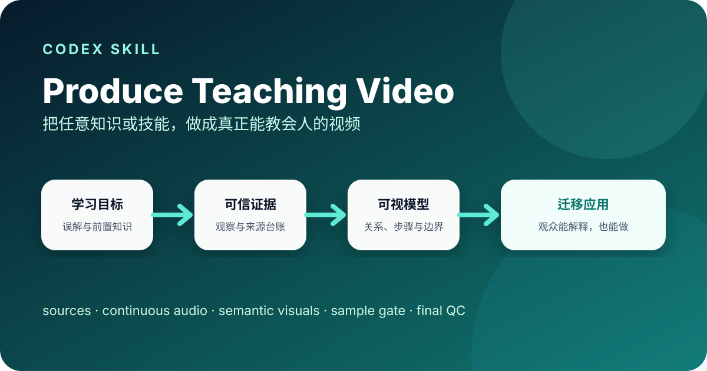

<div align="center">
  
</div>

# Produce Teaching Video

把任意学科或技能主题，制作成一条真正帮助观众理解、解释并迁移应用的教学视频。

[](./SKILL.md)
[](./LICENSE)
[](./CHANGELOG.md)
[](https://github.com/rui8001/produce-teaching-video/actions/workflows/quality.yml)

> 这不是“套模板生成动画”。它先定义学习者需要发生什么变化，再锁定证据、心智模型、连续配音、真实时间轴、样片和迁移检验。

[English overview](./README.en.md)

## 适合什么

- 物理、数学、历史、语言等学科概念讲解
- 编程、软件操作、实验和职业技能教程
- 课程短视频、概念动画、步骤演示和培训内容
- 已有教学视频的结构诊断、续做或质量检查

不适合以宣传、转化或品牌曝光为唯一目标的普通推广片；这种需求更适合使用独立的选题知识视频流程。

## 你会得到什么

| 产物 | 解决的问题 |
| --- | --- |
| 学习简报 | 明确受众、前置知识、单一目标和常见误解 |
| 来源台账 | 区分事实、证据、解释、理想化模型和未知项 |
| 口播与表演稿 | 把真正说出口的话、表演提示和视觉动作分离 |
| 真实音频时间线 | 用连续配音决定字幕和动画，而不是按字数猜时长 |
| 视觉计划 | 用人物、证据和模型帮助观众建立可迁移的心智模型 |
| 样片闸门 | 在全量制作前验证核心教学互动和真实转场 |
| 最终质检 | 同时检查学科准确性、学习效果、版权、隐私和输出规格 |

## 方法一览


核心顺序通常是：**预测或尝试 → 观察变化 → 冻结比较 → 通俗解释 → 引入术语或步骤 → 迁移到相邻问题**。这是一条教学逻辑，不是强制套用的镜头模板。

## 一分钟开始

### 1. 安装

个人安装：

```bash
git clone https://github.com/rui8001/produce-teaching-video.git \
  ~/.codex/skills/produce-teaching-video
```

也可以克隆到某个项目的 `.agents/skills/produce-teaching-video/`，让 Skill 随项目维护。

### 2. 调用

```text
$produce-teaching-video 把“为什么不是每个月都有日食”制作成一条面向初中生的教学视频。
```

或直接描述任务：

```text
帮我把“Git 分支合并”做成一条能让新手跟着操作并完成迁移练习的教程。
```

### 3. 从示例开始

查看 [日食教学简报](./examples/solar-eclipse/brief.json) 和对应的 [示例说明](./examples/solar-eclipse/README.md)。它展示的是公开、脱敏的输入结构，不包含作者的真实生产项目或素材。

## Skill 如何工作

1. 锁定学习者、单一目标、前置知识、误解、模型边界和迁移任务。
2. 建立来源台账；缺少事实写成 `needs_source`，缺少合法素材写成 `needs_asset`。
3. 锁定只包含实际口播的脚本，再生成或导入一整段连续配音。
4. 从真实音频生成字幕时间线，并按语义而不是标点规划镜头。
5. 用 `persona / evidence / model` 三种语义角色组织画面。
6. 先做覆盖核心教学互动的代表性样片，批准后再完成全片。
7. 以迁移任务、学科准确性、可访问性、版权和隐私完成终检。

详细规则见：

- [课程设计](./references/lesson-design.md)
- [生产流程](./references/production-workflow.md)
- [产物约定](./references/artifacts.md)
- [多角色连续音频](./references/multi-role-audio.md)

## 仓库结构

```text
produce-teaching-video/
├── SKILL.md                 # Codex 加载入口
├── agents/openai.yaml       # Skill 展示信息
├── references/              # 课程设计和生产方法
├── examples/                # 可公开复用的示例输入
├── assets/                  # 项目封面和图标
├── README.md                # 面向使用者的项目首页
└── CHANGELOG.md             # 版本记录
```

## 安全边界

仓库只包含制作方法、结构模板和公开示例，不包含真实学生信息、受版权限制的教材扫描、角色包、账号、Cookie、API Key、内部资料、配音样本或最终成片。安装 Skill 不代表授权它购买服务、访问账号或公开发布内容。

发现安全或隐私问题请阅读 [SECURITY.md](./SECURITY.md)。参与贡献请阅读 [CONTRIBUTING.md](./CONTRIBUTING.md)。

## Roadmap

当前优先推进两个公开、可复现的完整案例：一个物理案例和一个非物理案例，同时补齐自动检查、全新安装验证和真实用户试用。

- [两周公开维护路线图](./ROADMAP.md)
- [真实用户试用说明](./docs/USER_TESTING.md)
- [Codex for Open Source 申请准备度](./docs/CODEX_OSS_APPLICATION.md)

后续再根据真实使用反馈增加 JSON Schema、更多学科模式和工具实现参考，避免为了显得丰富而堆积没有验证过的模板。

## License

[MIT](./LICENSE) © 2026 rui8001
