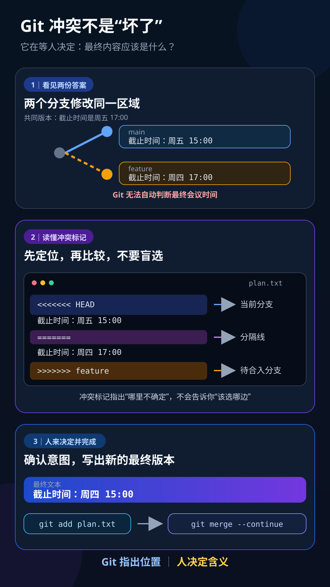

# 完整公开示例：安全处理一个 Git 合并冲突

这个合成示例展示 `produce-teaching-video` 如何从概念解释迁移到可操作的软件技能。事实来自 Git 官方文档，终端状态由仓库内的临时演示脚本复现，画面为自绘 SVG；它不读取任何真实代码仓库，也不会把估算时长冒充真实音频时间线。



## 最小调用

```text
$produce-teaching-video 把“如何安全处理一个简单 Git 合并冲突”做成一条面向 Git 初学者的教学视频。
```

## 产物索引

| 产物 | 状态 | 用途 |
| --- | --- | --- |
| [学习简报](./brief.json) | 已锁定 | 锁定学习者、目标、误解、边界和授权 |
| [来源台账](./source-ledger.md) | 已核对 | 区分官方事实、真实演示证据和教学简化 |
| [确定性演示](./demonstration.md) | 已验证 | 在临时仓库复现冲突、解决和完成状态 |
| [演示脚本](./demo.sh) | 已执行 | 生成合成冲突，不接触调用者现有仓库 |
| [纯口播稿](./script.zh-CN.txt) | 已锁定 | 只保留真正说出口的话 |
| [表演稿](./dialogue.json) | 已锁定 | 记录语气、停顿和教学功能 |
| [视觉计划](./visual-plan.json) | 语义已锁定 | 先定义状态变化，真实时长等待音频 |
| [自绘示意图](./assets/conflict-state-model.svg) | 已完成 | 展示分支差异、冲突标记和人工决策 |
| [生产状态](./production-status.md) | 持续更新 | 记录检查点、授权边界和下一步 |
| [质检记录](./qc-notes.md) | 预制作检查已完成 | 区分已验证步骤与待音频、样片验证项 |

## 教学路径

1. 先让学习者看到合并停止，判断“Git 是否坏了”。
2. 用两个分支修改同一行的状态图解释冲突为什么出现。
3. 冻结冲突标记，分清当前分支、分隔线和待合入分支。
4. 明确 Git 只能指出歧义，不能代替人判断最终需求。
5. 演示编辑最终文本、删除标记、`git add` 和 `git merge --continue`。
6. 补充停止条件：需要放弃本次合并时使用 `git merge --abort`，并说明脏工作区风险。
7. 用“两边各改对一半”的相邻情形检验迁移，而不是让学习者背命令。

## 哪些决定可以跨学科复用

- 从一次失败或错误预测开始，让学习需要变得具体。
- 同时保留事实来源、可观察证据、解释模型和模型边界。
- 冻结两个状态进行比较，再引入精确术语或操作。
- 把口播、表演提示、画面动作和真实时间轴分离。
- 用相邻问题检验迁移，并在真实音频出现前保持时间未锁定。

## 哪些决定属于 Git 主题

- 证据不是天文几何图，而是临时仓库中的真实 `git status`、冲突标记和合并提交。
- 操作顺序必须保持 `检查 → 理解意图 → 编辑 → 验证 → add → continue`，不能把 `ours/theirs` 当成通用答案。
- 命令输出受 Git 版本、语言、配置、编辑器和合并驱动影响；示例只覆盖一个文本文件的普通合并冲突。

## 如何继续成片

1. 由维护者或试用者确认配音方式，生成或录制一整段连续口播。
2. 从被接受的音频生成对齐和字幕，再给 `visual-plan.json` 锁定真实时间。
3. 先制作覆盖“冲突出现 → 标记比较 → 人工决策 → 状态完成”的代表性样片。
4. 根据 [质检记录](./qc-notes.md) 完成步骤准确性、可读性、版权、隐私和输出检查。

在真实音频出现之前，不填写逐句秒数，也不宣称字幕或最终成片已经完成。运行演示脚本只会创建并自动清理一个临时仓库。
