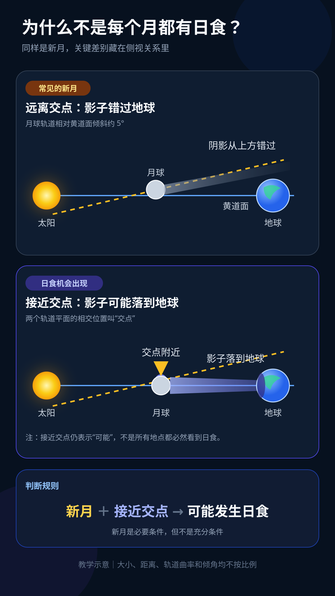

# 完整公开示例：为什么不是每个月都有日食

这个脱敏示例展示 `produce-teaching-video` 如何把一个初中天文问题推进到真实音频之前的可复核检查点。事实来自公开 NASA 资料，画面是仓库内自绘示意；它不包含作者的原始生产素材，也不会用估算时长冒充真实音频时间线。



## 最小调用

```text
$produce-teaching-video 把“为什么不是每个月都有日食”做成一条面向初中生的教学视频。
```

## 产物索引

| 产物 | 状态 | 用途 |
| --- | --- | --- |
| [学习简报](./brief.json) | 已锁定 | 锁定学习者、目标、误解、边界和授权 |
| [来源台账](./source-ledger.md) | 已核对 | 把事实主张、教学推论和模型限制分开 |
| [纯口播稿](./script.zh-CN.txt) | 已锁定 | 只保留真正说出口的话 |
| [表演稿](./dialogue.json) | 已锁定 | 记录语气、停顿和教学功能，不混入口播文本 |
| [视觉计划](./visual-plan.json) | 语义已锁定 | 先定义镜头意义，真实时长等待音频 |
| [自绘示意图](./assets/alignment-model.svg) | 已完成 | 演示“错过地球”和“接近交点”两种状态 |
| [生产状态](./production-status.md) | 持续更新 | 记录已锁定项、授权边界和下一步 |
| [质检记录](./qc-notes.md) | 预制作检查已完成 | 明确哪些已验证、哪些仍待真实音频和成片验证 |

## 教学路径

1. 先提出预测：既然新月大约每月一次，为什么日食不是每月都有？
2. 用俯视投影制造“似乎会排成一线”的直觉。
3. 切到侧视模型，暴露约五度的轨道倾角。
4. 比较远离交点与接近交点时，月球影子是否落到地球上。
5. 总结判断条件：新月只是必要条件，还要接近交点。
6. 迁移到月食：满月接近交点，地球位于太阳与月球之间。

## 如何继续成片

1. 由维护者或试用者确认配音方式及相应授权，生成或录制一整段连续口播。
2. 以被接受的音频生成对齐和字幕，再把 `visual-plan.json` 的语义镜头锁到真实时间。
3. 先制作覆盖“俯视误解 → 侧视纠正 → 交点比较”的代表性样片。
4. 根据 [质检记录](./qc-notes.md) 完成学科、教学、视听、版权、隐私和输出检查。

在真实音频出现之前，不填写逐句秒数，不宣称字幕或最终成片已经完成。太阳、地球、月球的大小和距离以及图中的倾角均为教学示意，不按真实比例。
